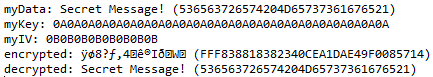

# Crypto3DES
## About
*Crypto3DES* is a Java project to demonstrate the use of the 3DES algorithm (CBC only).

This project was created as an exercise to demonstrate 3DES encryption and decryption.

*Crypto3DES* is written in Java 8 with Eclipse IDE.

## Code
To perform the encryption/decryption 3DES CBC needs three things:
1. the data to be encrypted or decrypted
2. a key
3. an initialization vector (IV)

Please note that all three for this class must be in the format `byte[]`. If you only have string data, you can use the `.getBytes()` method (line 2)  to convert the string to a `byte[]`

```java
String myDataString = "Secret Message!";
byte[] myData = myDataString.getBytes();
byte[] myKey = new byte[] {(byte)0x0A, ...};
byte[] myIV = new byte[] {(byte)0x0B, ...};
```

An object can be created in the usual way:

```java
Crypto3DES crypto = new Crypto3DES(myKey, myIV);
```

Encryption:

```java
byte[] encrypted = crypto.encrypt(myData);
```

Decryption:

```java
byte[] decrypted = crypto.decrypt(encrypted);
```


## Output preview

